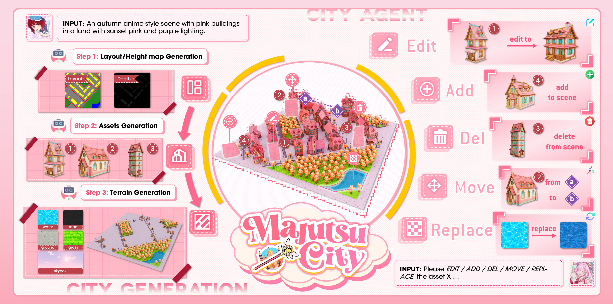
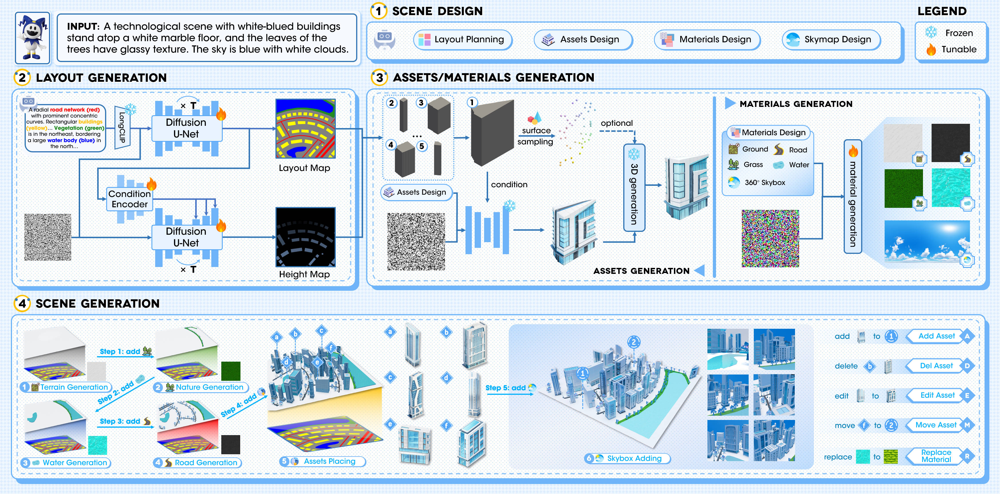

<p align="center">
  
</p>

# MajutsuCity: Language-driven Aesthetic-adaptive City Generation with Controllable 3D Assets and Layouts

<p align="center">
  <a href="https://arxiv.org/abs/2511.20415" target="_blank">
    
  </a>
  <a href="https://github.com/LongHZ140516/MajutsuCity" target="_blank">
    
  </a>
  <a href="https://longhz140516.github.io/MajutsuCity/" target="_blank">
    
  </a>
  <a href="https://huggingface.co/datasets/SereinH/MajutsuDataset" target="_blank">
    
  </a>
</p>

<p align="center">
  
</p>


## 🏗️ Pipeline Overview

<p align="center">
  
</p>

## 📜 TODO List
- [x] Release ${\color{#8D88E2}MajutsuDataset}$
- [ ] Release ${\color{#6EB4F9}MajutsuCity}$
  - [ ] Layout Generation model
  - [ ] Material texture fintuned model
  - [ ] Framework code
- [ ] Release ${\color{#FF7FAE}MajutsuAgent}$ code

## 🙏 Acknowledgements

- Some visual design inspirations (e.g., icons and layout ideas) are adapted from [awesome-framework-gallery](https://github.com/LongHZ140516/awesome-framework-gallery), [Arknights](https://ak.hypergryph.com/#index) and [Arknights: Endfield](https://endfield.hypergryph.com/).

## 📝 Citation

```bib
@article{huang2025majutsucity,
  title={MajutsuCity: Language-driven Aesthetic-adaptive City Generation with Controllable 3D Assets and Layouts},
  author={Huang, Zilong and He, Jun and Huang, Xiaobin and Xiong, Ziyi and Luo, Yang and Ye, Junyan and Li, Weijia and Chen, Yiping and Han, Ting},
  journal={arXiv preprint arXiv:2511.20415},
  year={2025}
}
```


